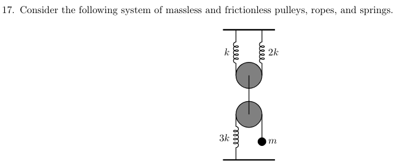
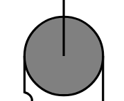
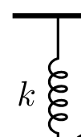
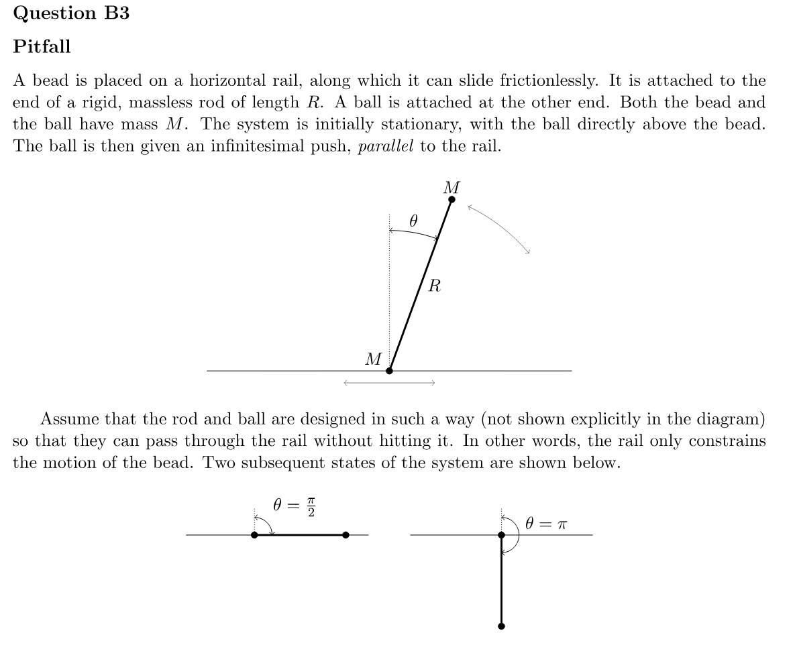
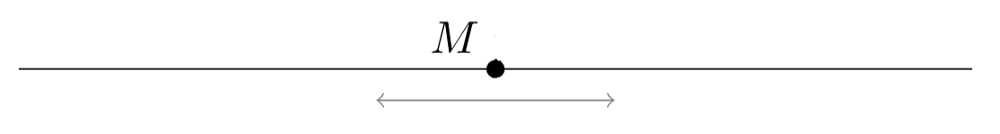
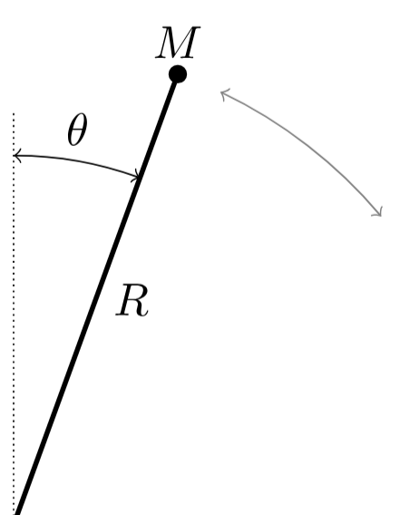
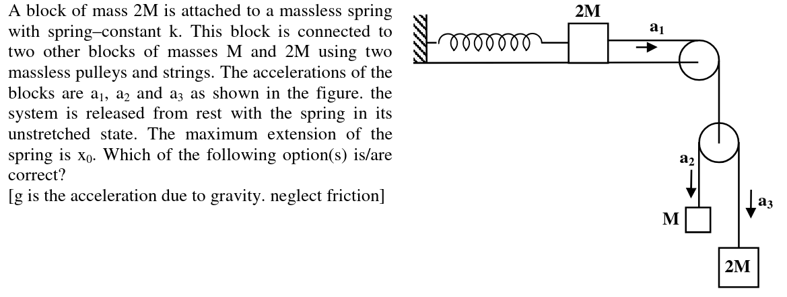
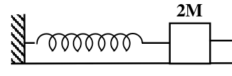

# Supplementary Material for Rebuttal Experiment 1

This page collects the supplementary materials referenced in our rebuttal response on the scalability of LLMs for extending our DSL. It summarizes the benchmark questions, the new reusable entities introduced by the agent, the corresponding natural-language descriptions, and placeholder slots for videos and figures that will be added shortly.

In the rebuttal, this page is intended to support the claim that LLMs can reliably extend the DSL by writing reusable entities, while direct raw MuJoCo XML generation remains much less reliable.

---

## F=MA 2024 Q17

### Question

<figure style="margin: 1.25rem 0; text-align: center;">
  
  <!-- <figcaption style="margin-top: 0.5rem; color: #666;">Benchmark question used for the DSL-extension experiment.</figcaption> -->
</figure>

### Invented Entities and their Natural-Language Descriptions

**`3-point-movable-pulley`**

<figure style="margin: 1rem 0; text-align: center;">
  
  <figcaption style="margin-top: 0.5rem; color: #666;">Entity 1: <code>3 point movable pulley</code></figcaption>
</figure>

> a movable pulley of mass &lt;mass:float&gt;1 kg is used as a reusable transmission node. It exposes independent left and right branches and a center hook on the &lt;side:up/down&gt;1 side.

**`anchored spring`**

<figure style="margin: 1rem 0; text-align: center;">
  
  <figcaption style="margin-top: 0.5rem; color: #666;">Entity 2: <code>anchored spring</code></figcaption>
</figure>

> a spring with stiffness &lt;k:float&gt;1 N/m and natural length &lt;length:float&gt;1 m is anchored to a fixed support. The spring points toward &lt;dir:up/down/left/right&gt;1 and its movable endpoint mass is &lt;m:float&gt;1 kg. The same endpoint is exposed for connection to an external light string.

### MuJoCo Simulations

  <strong>Placeholder video: DSL-generated simulation</strong> 
  Suggested file: <code>./videos/fma_2024_q17_dsl.mp4</code>

  <strong>Placeholder video: direct-XML attempt</strong> 
  Suggested file: <code>./videos/fma_2024_q17_xml.mp4</code>

### Direct-XML Failure Example

  <strong>Placeholder figure or video</strong> 
  Add a representative failure case here, for example: 
  <code>./figures/fma_2024_q17_xml_failure.png</code>

---

## USA PhO 2019 B3

### Question

<figure style="margin: 1.25rem 0; text-align: center;">
  
  <!-- <figcaption style="margin-top: 0.5rem; color: #666;">Benchmark question used for the DSL-extension experiment.</figcaption> -->
</figure>

### Invented Entities and their Natural-Language Descriptions

**`slider mass`**

<figure style="margin: 1rem 0; text-align: center;">
  
  <figcaption style="margin-top: 0.5rem; color: #666;">Entity 1: <code>slider mass</code></figcaption>
</figure>

> a carriage of mass &lt;mass:float&gt;1 kg is constrained to horizontal translation. The carriage has an exposed top pivot and side connectors for attaching strings.

**`light rod pendulum`**

<figure style="margin: 1rem 0; text-align: center;">
  
  <figcaption style="margin-top: 0.5rem; color: #666;">Entity 2: light rod pendulum</figcaption>
</figure>

> a rigid rod of length &lt;length:float&gt;1 m carries a bob of mass &lt;mass:float&gt;1 kg. The assembly rotates about a top pivot, initially tilted at an angle of &lt;slope:float&gt;1 degrees from horizontal.

### MuJoCo Simulations

  <strong>Placeholder video: DSL-generated simulation</strong> 
  Suggested file: <code>./videos/usapho_2019_b3_dsl.mp4</code>

  <strong>Placeholder video: direct-XML attempt</strong> 
  Suggested file: <code>./videos/usapho_2019_b3_xml.mp4</code>

### Direct-XML Failure Example

  <strong>Placeholder figure or video</strong> 
  Add a representative failure case here, for example: 
  <code>./figures/usapho_2019_b3_xml_failure.png</code>

---

## JEE Advanced 2019 Paper 2

### Question

<figure style="margin: 1.25rem 0; text-align: center;">
  
  <!-- <figcaption style="margin-top: 0.5rem; color: #666;">Benchmark question used for the DSL-extension experiment.</figcaption> -->
</figure>

### Invented Entities and their Natural-Language Descriptions

**`spring mass`**

<figure style="margin: 1rem 0; text-align: center;">
  
  <figcaption style="margin-top: 0.5rem; color: #666;">Entity 1: <code>spring mass</code></figcaption>
</figure>

> a block of mass &lt;mass:float&gt;1 kg can slide on a plane inclined at &lt;angle:float&gt;1 degrees. Its left side is attached to a spring fixed to a wall. The spring has stiffness &lt;k:float&gt;1 N/m and natural length &lt;length:float&gt;1 m. The right side of the block is available for connection to another entity by a light string.

### MuJoCo Simulations

  <strong>Placeholder video: DSL-generated simulation</strong> 
  Suggested file: <code>./videos/jee_advanced_2019_paper2_dsl.mp4</code>

  <strong>Placeholder video: direct-XML attempt</strong> 
  Suggested file: <code>./videos/jee_advanced_2019_paper2_xml.mp4</code>

### Direct-XML Failure Example

  <strong>Placeholder figure or video</strong> 
  Add a representative failure case here, for example: 
  <code>./figures/jee_advanced_2019_paper2_xml_failure.png</code>

---

## Notes for Final Asset Drop-In

- Replace each placeholder block with the final image or video embed once the assets are available locally.
- A natural public link for the rebuttal is: `https://physics-rl.github.io/rebuttal_exp1/`
- This page is intentionally focused on the LLM-scaling experiment described in the general reviewer response.
